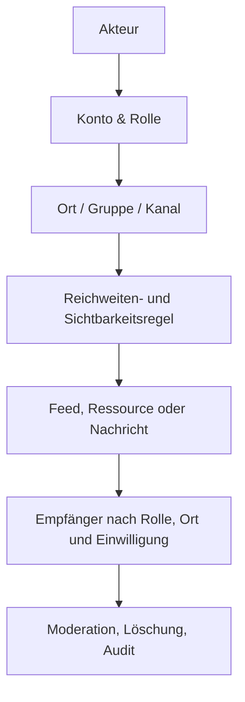

# ARCHITECTURE.md - Struktur & Architekturkonzept

> LOCUTERRA hat noch keine technische Implementierung. Diese Datei beschreibt
> deshalb die konzeptionelle Zielarchitektur und die wichtigsten Domänenmodule.

## Overview

LOCUTERRA sollte als modulares System gedacht werden, bei dem Identität,
Orte, Reichweiten, Gruppen, Kommunikation, Ressourcen, Kanäle und Governance
getrennte Verantwortungsbereiche haben. Ressourcen und Marktplätze sind dabei
bewusst getrennt: Ressourcen bleiben nicht-kommerziell, Marktplätze bekommen
später eine eigene Transaktionslogik. Das ist wichtig, weil das Projekt
personenbezogene Daten, reale Orte, öffentliche Stellen und potenziell
kritische Warnmeldungen berührt.

Die Betriebslogik für Trägerschaft, Moderation und Einspruch steht in
[GOVERNANCE.md](./GOVERNANCE.md). Dort ist festgelegt, wie
öffentlich-rechtliche oder gemeinnützige Trägerschaft, Betrieb, lokale
Verantwortung und zentrale Moderation voneinander getrennt werden.

Die Sicherheits- und Missbrauchsperspektive ist deshalb kein Nebenthema,
sondern ein eigener Architekturbaustein. Die ausführliche Spezifikation steht
in [SICHERHEIT_UND_MISSBRAUCH.md](./SICHERHEIT_UND_MISSBRAUCH.md).

Für einen ersten MVP empfiehlt sich eine kleine vertikale Scheibe:
Bürgerkonto, Ort, Gruppe, Ressource, Sichtbarkeit und Direktnachricht.
Kommunale Warnungen, Marktplätze und Sponsoring sollten erst später ergänzt
werden.

Für die Plattformseite heißt das zusätzlich: Der erste MVP muss im Browser und
als PWA tragfähig sein, bevor native Hüllen oder Store-Kanäle eröffnet
werden.

## Technischer Zielstack

LOCUTERRA startet als Web/PWA-first-System, damit eine Codebasis viele
Zielplattformen abdecken kann, ohne das Projekt zu früh in mehrere native
Clients zu zerteilen.

- **Frontend:** `TypeScript`, `React`, `Next.js`
- **UI:** responsive Webapp mit PWA-Fähigkeit
- **Datenhaltung:** `PostgreSQL`
- **ORM:** `Prisma`
- **Validierung:** `Zod`
- **Tests:** `Vitest` für Unit-Tests, `Playwright` für Flow-Tests
- **Spätere Verpackung:** optionale Shells für Android, iOS und Desktop

Der operative Plattformpfad ist dabei:

- **Webapp zuerst:** Bürger-, Gruppen-, Ressourcen-, Kanal- und
  Moderationsflächen entstehen zuerst als responsive Weboberfläche.
- **PWA direkt mitdenken:** installierbare Nutzung, Push und begrenzte
  Offline-Fähigkeit werden im Webkern vorbereitet.
- **Android/iOS nur als spätere Hülle:** erst wenn PWA-Grenzen bei Push,
  Teilen, Dateien oder Geräteschnittstellen echten Zusatznutzen begründen.
- **Windows/macOS/Linux zunächst browser-first:** kein früher eigener Client,
  sondern später höchstens Wrapper- oder Backoffice-Auslieferung.

Die ausführliche Rollout-Logik steht in [PORTIERUNGSPLAN.md](./PORTIERUNGSPLAN.md).

## Domänenmodule

| Modul | Zweck | MVP? |
|---|---|:---:|
| **Identity & Accounts** | Kontenarten, Profile, Verifikation, Pseudonymität | Ja |
| **Places** | Reale Orte, Standortbezug, Ortsfeeds | Ja |
| **Groups** | Öffentliche/private Gruppen mit Reichweiten | Ja |
| **Reach & Visibility** | Dorf-, Kommunal-, Regional-, Landes- und Welt-Ebenen | Ja |
| **Resources** | Nicht-kommerzielle Angebote und Gesuche, ohne Preis- oder Checkout-Logik | Ja |
| **Messaging** | Direktnachrichten und Kontaktaufnahme | Ja |
| **Channels** | Informationskanäle und Abonnements; fachlich in `INFORMATIONSKANAL_FLOW.md` beschrieben | Spezifiziert, Implementierung später |
| **Public Contact Points** | Bürgerkontakt-Anfragen an Institutionen | Später |
| **Warnings** | Katastrophen- und Krisenwarnungen | Später, hochsensibel |
| **Marketplace** | Geldbasierte Angebote mit separater Transaktionslogik | Später, getrennt |
| **Sponsoring/Arena** | Ortsbezogene Sponsoringsichtbarkeit; Details in [FINANZIERUNGSKONZEPT.md](./FINANZIERUNGSKONZEPT.md) | Später |
| **Moderation & Trust** | Meldungen, Sperren, Missbrauchsschutz; Details in `SICHERHEIT_UND_MISSBRAUCH.md` und `GOVERNANCE.md` | Spezifiziert |

## Konzeptioneller Datenfluss



## Abgrenzung Ressourcen vs. Marktplatz

Die Trennung ist fachlich und technisch relevant:

- Ressourcen dienen lokaler Hilfe, Verfügbarkeit und Kontaktaufnahme.
- Marktplätze dienen bezahlten Angeboten, Bestellungen und Gebühren.
- Beide Systeme dürfen dieselben Orte oder Reichweiten referenzieren, aber
  nicht dieselben Geschäftsregeln teilen.
- Der MVP implementiert nur das Ressourcensystem.

Die Details stehen in [RESSOURCEN_UND_MARKTPLATZ.md](./RESSOURCEN_UND_MARKTPLATZ.md).

## Ressourcen-Flow im MVP

Der operative Ablauf für Ressourcen ist in
[RESSOURCEN_FLOW.md](./RESSOURCEN_FLOW.md) beschrieben. Für die Architektur
ist wichtig, dass derselbe Flow auf Mobilgeräten schnell erfassbar und auf dem
Desktop gut verwaltbar bleibt.

Architektonisch heißt das:

- Erfassung und Sichtbarkeit gehören in denselben klaren Eingabeprozess.
- Kontaktaufnahme darf nur über den freigegebenen Kontext erfolgen.
- Archivierung und Löschung müssen ohne Medienbruch möglich sein.
- Eine spätere Marktlogik darf diesen Flow nicht im Nachhinein verbiegen.

## Kernobjekte

| Objekt | Minimale Felder für MVP |
|---|---|
| **Account** | ID, Kontotyp, Anzeigename, Verifikationsstatus, Datenschutzstatus |
| **Place** | ID, Name, Typ, Geometrie/Position, Sichtbarkeit |
| **Group** | ID, Name, Ort, Sichtbarkeit, Mitgliedschaftsregel |
| **Resource** | ID, Anbieter, Typ, Beschreibung, Ort/Reichweite, Status |
| **Message** | ID, Sender, Empfänger, Bezug, Inhalt, Zeitstempel, Löschstatus |
| **Channel** | ID, Betreiber, Reichweite, Abostatus, Chatmodus |

Das logische Datenmodell ist in [DATENMODELL.md](./DATENMODELL.md) genauer
ausgearbeitet. Die Datenschutz- und Einwilligungslogik steht in
[DATENSCHUTZ.md](./DATENSCHUTZ.md). Dort sind auch Einwilligungen, Audit-Events
und die Trennung von Sichtbarkeit und Reichweite beschrieben.

Der Informationskanal-Flow ist separat in
[INFORMATIONSKANAL_FLOW.md](./INFORMATIONSKANAL_FLOW.md) spezifiziert. Für
die Architektur bedeutet das: Abo, Benachrichtigungen, Begleitchat und
Kontaktfreigabe werden nicht zu einer einzigen Funktion vermischt, sondern als
getrennte Teilflüsse behandelt.

## Datenschutzrelevante Architekturfragen

Die konkrete Ausarbeitung steht in [DATENSCHUTZ.md](./DATENSCHUTZ.md). Für
den Architekturentwurf bleiben diese Fragen wichtig:

- Welche Daten sind pseudonym, welche identifizierend?
- Wann darf ein Kanal echte Kontaktdaten anfordern?
- Wie werden Kontaktfreigaben widerrufen und entkoppelt?
- Welche Daten bleiben sichtbar, wenn ein Nutzer einen Ort verlässt?
- Wie werden Löschung, Export und Audit ohne Überwachung umgesetzt?

## Zielstruktur für spätere Implementierung

```text
DECIDE_LOCUTERRA/
├── docs/              # Spezifikationen, Wireframes, Datenschutzkonzept
├── src/               # Anwendungscode, sobald Stack entschieden ist
├── tests/             # Rollen-, Rechte-, Sichtbarkeits- und Flow-Tests
├── workflows/         # Wiederkehrende Projektabläufe
├── _tools/            # Projektnahe Hilfswerkzeuge
└── releases/          # Distributionen ab erster veröffentlichbarer Version
```

## Historie

- **2026-05-16** - Ressourcen-Flow für den MVP in `RESSOURCEN_FLOW.md`
  konkretisiert und an die Architektur angebunden.
- **2026-05-09** - Initiale konzeptionelle Architektur aus `KONZEPT.md`
  abgeleitet.
