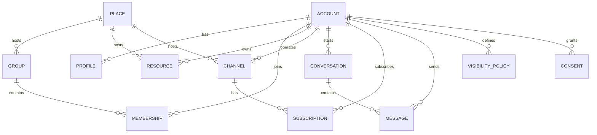

# DATENMODELL.md - Logisches MVP-Datenmodell

> Dieses Dokument konkretisiert das MVP 0.1 von LOCUTERRA. Es beschreibt ein
> logisches Datenmodell, noch keine finale DB-Schemadatei.

## Ziel

Das Datenmodell soll die Entscheidungen aus `KONZEPT.md`,
`ROLES_AND_RIGHTS.md`, `ARCHITECTURE.md` und `DECISIONS.md` in eine klare,
umsetzungsnahe Struktur überführen.

Für Version 0.1 gilt:

- ein echter Login-Typ: Bürgerkonto
- lokale Initiativen nur als abgeleitete Gruppen- oder Ortsidentitäten
- Ressourcen bleiben nicht-kommerziell
- Marktplatzlogik bleibt getrennt
- Sichtbarkeit wird explizit modelliert, nicht implizit angenommen

## Modellierungsprinzipien

1. Jede fachliche Entität bekommt eine stabile ID.
2. Objektrollen werden von Konten getrennt.
3. Sichtbarkeit, Reichweite und Einwilligung sind eigene Konzepte.
4. Ortsbezug ist optional, aber für viele Objekte im MVP zentral.
5. Löschung erfolgt über nachvollziehbare Status- und Audit-Felder.
6. Zukünftige Erweiterungen dürfen das MVP-Modell ergänzen, aber nicht
   aufweichen.

## Kernentitäten

| Entität | Zweck | Wichtige Felder |
|---|---|---|
| `account` | Login- und Identitätskern für Personen und spätere Organisationskonten | `id`, `account_type`, `display_name`, `verification_level`, `status`, `primary_place_id`, `created_at` |
| `profile` | Öffentliche oder halböffentliche Profildaten | `account_id`, `bio`, `avatar_ref`, `contact_visibility`, `locale`, `updated_at` |
| `place` | Reeller Ort, Stadtteil, Treffpunkt oder andere räumliche Einheit | `id`, `name`, `place_type`, `parent_place_id`, `geo_ref`, `visibility_scope`, `status` |
| `group` | Lokale Gemeinschaft, Initiative oder thematische Gruppe | `id`, `name`, `place_id`, `visibility_scope`, `membership_policy`, `status` |
| `membership` | Zuordnung eines Kontos zu einer Gruppe | `id`, `account_id`, `group_id`, `role`, `joined_at`, `left_at`, `state` |
| `resource` | Nicht-kommerzielle Ressource, Suche oder Angebot | `id`, `owner_kind`, `owner_id`, `place_id`, `resource_kind`, `title`, `description`, `visibility_scope`, `status` |
| `channel` | Informationskanal mit Feed und optionalem Begleitchat | `id`, `operator_kind`, `operator_id`, `place_id`, `channel_mode`, `visibility_scope`, `consent_required`, `status` |
| `subscription` | Abonnement eines Kontos auf einen Kanal | `id`, `channel_id`, `account_id`, `consent_id`, `state`, `expires_at`, `created_at` |
| `conversation` | Nachrichtenthread, z. B. Direktnachricht oder Kanalbegleitchat | `id`, `conversation_kind`, `subject_kind`, `subject_id`, `visibility_scope`, `status` |
| `message` | Einzelne Nachricht im Thread | `id`, `conversation_id`, `sender_account_id`, `body`, `attachment_ref`, `sent_at`, `deleted_at` |
| `visibility_policy` | Regel für Reichweite und Sichtbarkeit eines Objekts | `id`, `object_kind`, `object_id`, `reach_level`, `audience_rule`, `privacy_rule`, `updated_at` |
| `consent` | Einwilligung für Kontakt, Abos oder Kontaktfreigaben | `id`, `scope_kind`, `granted_by_account_id`, `target_kind`, `target_id`, `granted_at`, `revoked_at`, `retention_until` |
| `audit_event` | Nachvollziehbare Protokollierung sensibler Aktionen | `id`, `actor_account_id`, `action`, `object_kind`, `object_id`, `reason`, `risk_level`, `created_at` |

## Beziehungen

Hinweis: `object_kind`/`object_id` in `visibility_policy` und `consent` sind
bewusst generisch gehalten, damit das Modell später auch für weitere Objekte
wie Warnungen oder Kontaktstellen erweitert werden kann.

## Logische Regeln

### Accounts

- Ein `account` ist der technische Login-Kern.
- Ein Bürgerkonto ist im MVP der Standardfall.
- `verification_level` steuert Rechte, nicht die Sichtbarkeit allein.

### Places

- Ein `place` kann einen echten Ort, einen Treffpunkt oder eine lokale Zone
  beschreiben.
- Orte können verschachtelt sein, etwa Stadtteil unter Kommune.
- Ein Ort darf sichtbar sein, ohne dass alle zugehörigen Inhalte öffentlich
  sind.

### Groups

- Gruppen sind soziale Container mit klarer Zuständigkeit.
- Jede Gruppe braucht mindestens eine verantwortliche Person oder Stewards.
- Gruppen können öffentlich, privat oder einladungsbasiert sein.

### Resources

- Ressourcen sind ausdrücklich nicht-kommerziell.
- Geldbasierte Angebote gehören in ein separates Marktplatzmodul.
- Ressourcen können an Orte, Gruppen oder einzelne Konten gebunden sein.

### Channels

- Kanäle sind Informationsverteiler mit optionalem Begleitchat.
- Ein Kanal kann von einem Konto, einer Gruppe oder später einer Institution
  betrieben werden.
- Abonnements brauchen eine prüfbare Einwilligung, wenn Kontaktdaten oder
  Dauerbindungen betroffen sind.

### Conversations und Messages

- Nachrichten leben immer in einem `conversation`-Kontext.
- Direktnachrichten sind ein Sonderfall einer Unterhaltung.
- Löschungen sollten nachvollziehbar bleiben, daher sind `deleted_at` und
  Audit-Einträge vorgesehen.

### Visibility and Consent

- Sichtbarkeit ist pro Objekt explizit konfigurierbar.
- Einwilligungen laufen getrennt von Sichtbarkeitsregeln.
- Ablauf, Widerruf und Retention gehören ins Modell, nicht nur in die UI.
- Die fachliche Ausarbeitung der Datenschutzlogik steht in
  [DATENSCHUTZ.md](./DATENSCHUTZ.md).

## Statusfelder

Für die meisten Hauptobjekte sind dieselben Basiszustände sinnvoll:

- `draft`
- `active`
- `hidden`
- `archived`
- `deleted`

Für Beziehungen wie `membership` oder `subscription` sind zusätzlich Zustände
wie `pending`, `confirmed`, `paused` oder `revoked` sinnvoll.

## Nicht im MVP

Diese Dinge werden bewusst nicht in das erste Datenmodell gezogen:

- Zahlungs- oder Checkout-Daten
- Marktplatzartikel mit Transaktionen
- Krisenwarnungen als eigenes Fachmodul
- Sponsoring-/Arena-Mechanik
- globale Plattform-Audit-Überwachung ohne Anlass

## Umsetzungshinweise für später

- Bei einer ersten technischen Implementierung bietet sich ein relationales
  Schema mit klaren Foreign Keys an.
- `verification_level`, `visibility_scope` und `consent` sollten als eigene
  Felder modelliert werden, nicht als Textkonvention.
- Für spätere APIs sind stabile UUIDs und UTC-Timestamps sinnvoll.
- Eine erste DB-Initialisierung sollte das Modell aus diesem Dokument direkt
  ableiten.

## Offene Folgefragen

- Braucht ein `place` im MVP eine echte Geometrie oder reicht zunächst ein
  strukturierter Ortsbezug?
- Soll `conversation` im ersten Prototyp nur Direktnachrichten abbilden oder
  auch Kanal-Begleitchats?
- Werden `resource`-Anbieter und `channel`-Betreiber im MVP immer über
  `account` referenziert oder später auch über Gruppen?

## Ergebnis

Das Datenmodell für LOCUTERRA V0.1 ist jetzt so weit vorgezeichnet, dass die
nächsten Arbeitsschritte gezielt auf Datenschutz, Reichweite und Stack-Entscheid
aufbauen können.
