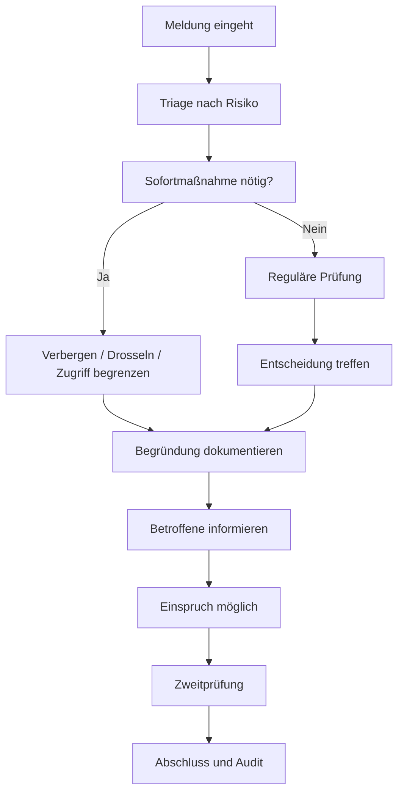

# GOVERNANCE.md - Trägerschaft, Entscheidungswege und Moderation

> Diese Spezifikation beschreibt, wie LOCUTERRA als gemeinwohlorientiertes
> oder öffentlich-rechtlich getragenes System geführt werden kann, ohne
> Produktentscheidungen, Moderation, Datenschutz und lokale Objektverantwortung
> in einer Hand zu vermischen.

## Ziel

LOCUTERRA braucht früh eine klare Betriebs- und Governance-Logik, weil reale
Orte, Kontaktanfragen, Informationskanäle und Meldungen nicht nur Produkt-
funktionen sind, sondern auch Verantwortung, Nachvollziehbarkeit und
Missbrauchsschutz auslösen.

Diese Spezifikation beantwortet deshalb drei Fragen:

1. Wer trägt das System rechtlich und organisatorisch?
2. Wer entscheidet über Regeln, Inhalte und Eskalationen?
3. Wie laufen Meldung, Moderation und Einspruch ab?

## Trägerschaftsmodell

Für V0.1 sind zwei Trägermodelle vorgesehen:

- öffentlich-rechtliche Trägerschaft, etwa durch eine kommunale oder sonstige
  öffentliche Stelle
- gemeinnützige Trägerschaft, etwa über Verein, Stiftung oder gemeinnützige
  Gesellschaft mit öffentlichem Auftrag

Die genaue Rechtsform ist später rechtlich zu prüfen. Für das Projektmodell
wichtig ist nur: Die Trägerschaft muss gemeinwohlorientiert sein und darf keine
privaten Reichweiten- oder Monetarisierungsanreize in die Kernlogik ziehen.

## Grundsätze

- Gemeinwohl vor Wachstum
- Transparenz vor intransparenten Eingriffen
- Minimalprinzip bei Rechten und Datensicht
- Trennung von Trägerschaft, Betrieb, Moderation und Objektverantwortung
- Lokale Selbstverwaltung, wo immer sie ohne Sicherheitsverlust möglich ist
- Keine stillen Inhaltseingriffe ohne Protokoll

## Governance-Ebenen

| Ebene | Verantwortung | Typische Entscheidungen |
|---|---|---|
| **Trägerbeirat** | Leitbild, Ziele, harte Regeln, Risikogrenzen | Produktprinzipien, Grundsätze, große Policy-Änderungen |
| **Betriebsleitung** | Alltag, Kapazität, Priorisierung, Dienstregeln | Release-Freigaben, Betriebspersonal, Eskalationswege |
| **Moderationsteam** | Einzelfallprüfung, Meldungen, Schutzmaßnahmen | Verbergen, Drosseln, Einschränken, Freigeben |
| **Datenschutz/Compliance** | Zweckbindung, Löschung, Auskunft, Audit | Aufbewahrung, Protokolltiefe, Löschfristen |
| **Lokale Stewards** | Orte, Gruppen, Kanäle und Ressourcen vor Ort | lokale Hausregeln, Sichtbarkeit, Pflege, Verifikation |
| **Einspruchsstelle** | unabhängige Zweitprüfung | Aufhebung, Bestätigung oder Anpassung von Entscheidungen |

## Entscheidungsregeln

| Entscheidung | Wer entscheidet | Bemerkung |
|---|---|---|
| Leitbild und Produktgrenzen | Trägerbeirat | z. B. keine Vermischung von Ressourcen und Marktplatz |
| Hausregeln und Moderationsleitlinie | Trägerbeirat + Moderation + Datenschutz | nur dokumentiert und versioniert |
| Lokale Objektpflege | Lokale Stewards | nur innerhalb ihres konkreten Objekts |
| Einzelfallmaßnahmen | Moderationsteam | begründet, befristet, protokolliert |
| Hohe Eingriffe, z. B. Kontosperre mit Langwirkung | Moderation + Zweitprüfung | Vier-Augen-Prinzip für sensible Fälle |
| Notfallwarnungen | zuständige öffentliche Stelle oder gesondert verifizierte Stelle | nie als normale Moderationsentscheidung behandeln |

## Meldung und Moderation

Moderation soll zuerst schützen, dann klären, erst zuletzt hart entfernen.
Sie darf Inhalte begrenzen, aber nicht unbemerkt umschreiben.

### 1. Eingang

Eine Meldung braucht mindestens:

- betroffenen Inhalt oder betroffene Funktion
- Meldekategorie
- kurze Begründung
- wenn sinnvoll: Dringlichkeitsmarkierung

### 2. Triage

Die erste Prüfung ordnet die Meldung grob ein:

- Spam, Flooding, Manipulation
- Doxxing, Datenschutz, unerwünschte Kontaktaufnahme
- Rollenmissbrauch, Fake-Initiative, Impersonation
- Belästigung, Drohung, Eskalation
- Fehler oder Missverständnis ohne Missbrauch

### 3. Sofortmaßnahmen

Wenn ein Schaden sofort droht, sind begrenzende Maßnahmen erlaubt:

- Inhalt temporär ausblenden
- Reichweite begrenzen
- Kontaktkanal stoppen
- Veröffentlichung pausieren
- Konto oder Rolle zeitweise einschränken

### 4. Entscheidung

Die Entscheidung muss immer enthalten:

- was genau getan wurde
- warum es getan wurde
- wer entschieden hat
- wie lange die Maßnahme gilt
- ob ein Einspruch möglich ist

### 5. Einspruch

Betroffene müssen einen klaren Einspruchsweg haben.
Die Zweitprüfung darf nicht dieselbe Person übernehmen, die die Erstentscheidung
getroffen hat, wenn die Maßnahme einen spürbaren Eingriff darstellt.

### 6. Abschluss

Nach Abschluss werden nur die für Nachvollziehbarkeit nötigen Daten behalten.
Stille Korrekturen ohne Protokoll sind nicht erlaubt.

## Eskalationsregeln

Ein Fall wird an die zentrale Moderation oder an eine zweite Instanz eskaliert,
wenn mindestens einer der folgenden Punkte zutrifft:

- Langfristige Sperre oder Rollenentzug
- Veröffentlichung betrifft viele Nutzer oder eine breite Reichweite
- Konflikt zwischen lokaler Verantwortung und Plattforminteresse
- Verdacht auf Missbrauch durch Steward, Moderator oder Admin
- möglicher Rechts- oder Datenschutzkonflikt

## Schutz gegen Machtmissbrauch

- Moderation und Plattformbetrieb bleiben von sozialer Rolle getrennt
- Betreiber sehen nicht automatisch mehr Klardaten
- sensible Eingriffe brauchen Protokoll
- Standard ist die kleinste wirksame Maßnahme
- Einspruch und Zweitprüfung sind immer vorgesehen

## Transparenz

LOCUTERRA sollte den Beteiligten sichtbar machen:

- welche Regel verletzt wurde
- welche Maßnahme aktuell gilt
- wie lange sie gilt
- an wen sich der Einspruch richtet

Öffentlich sichtbar sein soll nicht der gesamte Audit-Text, sondern nur die für
Verständlichkeit nötige Begründung.

## MVP-Scope

Im MVP genügt eine schlanke Governance-Struktur:

- ein Träger
- ein kleines Moderationsteam
- eine Einspruchsstelle
- lokale Stewards nur für ihre eigenen Objekte
- keine komplexe Mehrkammerstruktur

Das hält das System nachvollziehbar, bevor es skaliert oder in mehrere
Trägerformen auseinanderläuft.

## Verprobte Szenarien

Die folgenden Fälle wurden als fachliche Untergrenze durchgespielt:

| Fall | Maßnahme | Einspruchsergebnis |
|---|---|---|
| Spam im lokalen Kanal | kanalbezogene 24h-Sperre mit Drosselung | teilweise bestätigt, Maßnahme präzisiert |
| Fake-Initiative | vorläufige Einschränkung statt Totalsperre | teilweise erfolgreich nach nachgereichter Legitimation |
| Datenschutzverletzung | sofortige Ausblendung und befristete Sperre sensibler Inhalte | sensibler Teil abgelehnt, nur redigierter Rest bleibt möglich |

Die Verprobung zeigt:

- Sperren müssen im MVP objektbezogen und befristet bleiben, wenn die Lage das
  zulässt.
- Einspruch ist auch dann nützlich, wenn die Grundentscheidung richtig war,
  weil er den Maßnahmenschnitt schärfen kann.
- Datenschutzverstöße brauchen die engste und schnellste Reaktion.

## Offene Folgefragen

- Wie viele Personen braucht die Einspruchsstelle im MVP?
- Welche Maßnahmen brauchen zwingend Vier-Augen-Prüfung?
- Wie stark dürfen lokale Stewards im ersten MVP moderativ eingreifen?
- Wie werden Notfallwarnungen von normaler Inhaltsmoderation sauber getrennt?

## Ergebnis

LOCUTERRA hat damit einen ersten Governance-Rahmen:

- Trägerschaft ist gemeinwohlorientiert
- Moderation ist begrenzt und protokolliert
- Einspruch ist vorgesehen
- lokale Verantwortung bleibt von Plattformmacht getrennt
