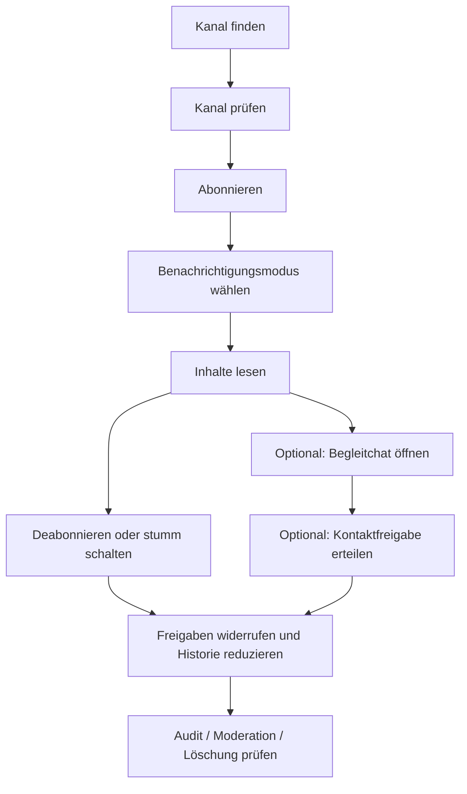

# INFORMATIONSKANAL_FLOW.md - Informationskanal-Flow für LOCUTERRA V0.1

Stand: 2026-05-17

> Dieses Dokument beschreibt den operativen Flow für abonnierbare
> Informationskanäle in LOCUTERRA: finden, abonnieren, Begleitchat nutzen,
> Kontaktfreigaben steuern und wieder deabonnieren.

## Ziel

Informationskanäle sind in LOCUTERRA kein bloßer Feed-Mechanismus, sondern ein
eigenes Kommunikationsobjekt. Sie sollen lokale oder institutionelle
Informationen zuverlässig ausspielen, ohne dass Sichtbarkeit, Chat und
Kontaktfreigabe automatisch miteinander verschmelzen.

Der Flow ist für den Web/PWA-first-Ansatz gedacht. Er muss daher auf dem
Mobilgerät schnell genug für Alltagsnutzung sein und auf dem Desktop genügend
Struktur für Betreiber und Moderation bieten.

## Geltungsbereich

Dieser Flow gilt für abonnierbare Informationskanäle im MVP und in späteren
Ausbaustufen:

- kommunale oder institutionelle Informationskanäle
- lokale Initiativen mit klarer Betreiberrolle
- optionale Begleitchats
- optionale Kontaktfreigaben für Rückfragen oder Eskalation

Nicht Teil dieses Flows sind:

- nicht-kommerzielle Ressourcen
- Marktplatzlogik
- private 1:1-Direktnachrichten
- Krisen- oder Katastrophenwarnungen als eigenes Spezialmodul

## Beteiligte

- Kanalbetreiber oder Steward
- abonnierende Konten
- Moderation
- Kontaktstelle, falls ein Kanal Rückfragen an echte Stellen weiterleitet
- System für Benachrichtigung, Audit und Widerruf

## Flow-Übersicht

## Schritt 1: Kanal finden

Ein Kanal muss auffindbar sein über:

- Ortskontext
- Gruppen- oder Organisationskontext
- Suche innerhalb der freigegebenen Reichweite
- kuratierte Empfehlungen, wenn der Nutzer bereits passende Kanäle nutzt

Die Kanalkarte zeigt nur Basisdaten:

- Titel
- Betreiber
- Reichweite
- Thema
- Moderationshinweis
- Status für Begleitchat oder Kontaktfreigabe

## Schritt 2: Kanal prüfen

Vor dem Abonnieren soll klar sein:

- wer den Kanal betreibt
- welche Reichweite er hat
- ob es nur einen Feed oder zusätzlich einen Begleitchat gibt
- ob Rückfragen über Kontaktfreigabe möglich sind
- welche Daten im Abo gespeichert werden

Der Kanal darf sichtbar sein, ohne dass Begleitchat oder Kontaktzugriff bereits
offen sind.

## Schritt 3: Abonnieren

Das Abonnement ist die fachliche Basis des Kanals.

Beim Abonnieren kann der Nutzer wählen:

- normale Benachrichtigungen
- reduzierte Benachrichtigungen
- stille Beobachtung ohne Push

Das Abo speichert nur die für die Zustellung nötigen Informationen. Es darf
nicht automatisch in ein dauerhaftes Kontaktverzeichnis übergehen.

## Schritt 4: Benachrichtigungsmodus wählen

Informationskanäle sollen nicht alle Nutzer gleich behandeln.

Für das MVP sind daher sinnvolle Modi:

1. Voll benachrichtigen
2. Zusammenfassen oder drosseln
3. Nur im Kanal selbst anzeigen

Der Modus ist eine reine Zustellpräferenz. Er ersetzt keine
Einwilligungserklärung für Kontaktfreigaben oder Begleitchat.

## Schritt 5: Inhalte lesen

Nach dem Abo erscheinen Beiträge im Feed oder in einem ortsbezogenen
Kontextstrom.

Wichtig ist:

- Sichtbarkeit des Kanals bedeutet nicht automatisch Sichtbarkeit aller
  Detaildaten.
- Inhalte dürfen je nach Reichweite zusammengefasst oder gekürzt erscheinen.
- Betreiber können Beiträge hervorheben, aber nicht still die Reichweite
  erweitern.

## Schritt 6: Begleitchat nutzen

Der Begleitchat ist ein optionaler, vom Feed getrennt zu behandelnder Raum.
Er dient Rückfragen, Koordination und moderierter Diskussion.

Regeln:

- Es gibt keinen Begleitchat ohne klare Kanalregel.
- Der Begleitchat darf nur sichtbar werden, wenn der Kanal ihn explizit
  anbietet.
- Der Chat ist keine automatische Verlängerung des Feeds.
- Der Chat kann eigene Hausregeln, Moderation und Teilnahmebedingungen haben.

Wenn der Begleitchat personenbezogene Kommunikation ermöglicht, braucht es
eine separate Einwilligung oder einen klaren Beitrittskontext.

## Schritt 7: Kontaktfreigabe steuern

Ein Kanal darf optional eine Kontaktfreigabe anbieten, wenn echte Rückfragen
oder Zuständigkeiten benötigt werden.

Die Standardregel lautet:

- Kanal sichtbar
- Kontakt nicht automatisch offen
- Kontakt nur nach ausdrücklicher Freigabe

Kontaktfreigabe kann bedeuten:

- interne Weiterleitung an eine Kontaktstelle
- befristete Freigabe für Rückfragen
- Freigabe nur für einen konkreten Kanalzweck

Sie darf nicht still in ein allgemeines Adressbuch oder in andere Kanäle
übertragen werden.

## Schritt 8: Deabonnieren oder stumm schalten

Der Nutzer muss das Abo einfach wieder beenden können.

Unterschiede:

- **Stumm schalten** beendet nur Benachrichtigungen.
- **Deabonnieren** beendet das Abo selbst.
- **Freigaben widerrufen** entfernen zusätzliche Kontakt- oder Chatrechte.

Für den MVP gilt: Ein Deabonnement soll die kanalbezogene Zustellung und den
kanalbezogenen Zugriff beenden. Separat erteilte Kontaktfreigaben müssen
explizit widerrufen werden, wenn sie nicht nur einmalig waren.

## Schritt 9: Moderation und Missbrauch

Typische Risiken:

- Spam über zu leicht abonnierbare Kanäle
- politische oder kommerzielle Manipulation über scheinbar lokale Kanäle
- Fake-Betreiber
- übergriffige Begleitchats
- schleichende Kontaktdaten-Sammlung

Moderation sollte zuerst begrenzen, verbergen oder drosseln. Ein Kanal darf
nicht still seine Reichweite, seinen Chat oder seine Kontaktregeln ohne
Nachvollziehbarkeit erweitern.

## Bezug zum Datenmodell

Der Flow arbeitet konzeptionell mit folgenden Objekten:

- `channel`
- `channel_subscription`
- `consent`
- `conversation`
- `message`
- `audit_event`

`channel_subscription` ist die spätere fachliche Trägerstruktur für das Abo.
`consent` hält Begleitchat und Kontaktfreigaben getrennt. `audit_event`
dokumentiert Widerrufe, Moderation und Rechteänderungen.

## Nächste technische Ableitung

Wenn LOCUTERRA in Code übergeht, sollte der Informationskanal-Flow als
eigenständiger, testbarer Pfad umgesetzt werden:

1. Kanal finden und anzeigen
2. Abo anlegen oder widerrufen
3. Benachrichtigungsmodus speichern
4. Begleitchat öffnen oder schließen
5. Kontaktfreigabe erteilen oder entziehen

Für den Web/PWA-first-Stack eignen sich dafür:

- Validierung mit `Zod`
- Flow-Tests mit `Playwright`
- fachliche Konsistenztests für Abo, Chat und Freigabe
