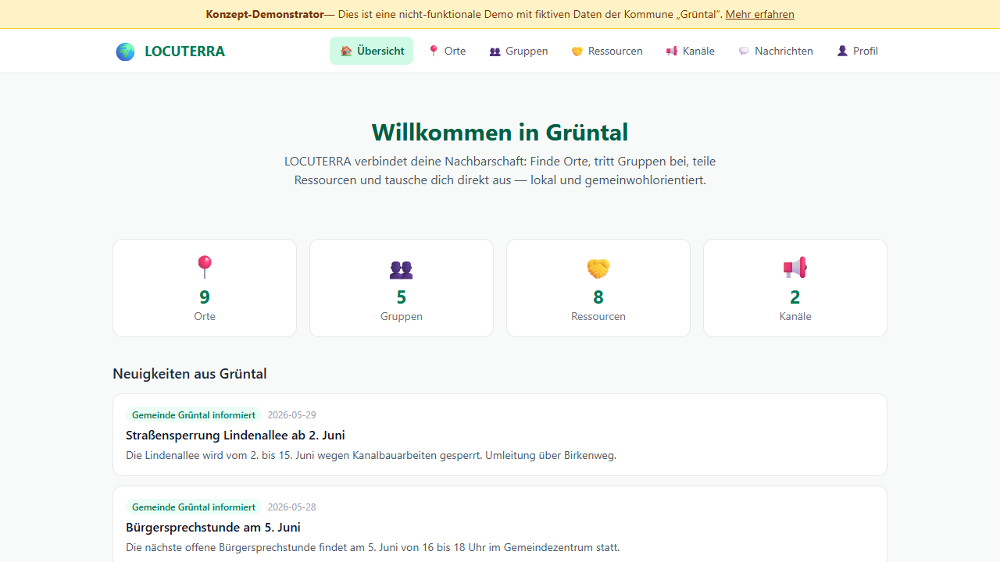

# LOCUTERRA

> [Deutsche Dokumentation](README_de.md)

> Concept and demonstrator for a public-interest, location-based
> social network connecting citizens, institutions, municipalities,
> organisations, and businesses.

LOCUTERRA aims to digitally connect local civic life without becoming
just another global feed. At its core are real places, reach levels,
public and private groups, resource sharing, information channels,
citizen contact points, direct messages, and location-based alerts.

**This repository is a gift:** We are making the entire concept freely
available so that municipalities, non-profit organisations, or
public-sector institutions can pick it up and build it.

## Demonstrator

**[View the live demo](https://um-bruch.github.io/locuterra/)**



The [`demo/`](./demo) folder contains the source code of the concept
demonstrator, built with Next.js, React, and TypeScript. It shows the
fictional municipality of **Grüntal** with synthetic data:

- **9 places** (districts, meeting points, facilities)
- **5 groups** (neighbourhood help, garden club, parents' meetup, ...)
- **8 resources** (tools, skills, requests, help)
- **2 information channels** with posts
- **Direct messages** between fictional citizens

The demo preview is also used as the social sharing image for the GitHub
Pages build.

### Run the demonstrator

```bash
cd demo
npm install
npm run dev
```

Then open `http://localhost:3000` in your browser.

The demonstrator is a statically exportable prototype with no backend.
All data is fictional and lives in the client.

## Concept documents

LOCUTERRA consists of two concepts: the **platform concept** (how the
network works) and the **financing concept** (how it sustains itself).
Both belong together but are deliberately documented separately.

| Document | Contents |
|---|---|
| [KONZEPT.md](./KONZEPT.md) | Original product idea and MVP scope |
| [FINANZIERUNGSKONZEPT.md](./FINANZIERUNGSKONZEPT.md) | Arena model, sponsoring, and revenue sharing |
| [ARCHITECTURE.md](./ARCHITECTURE.md) | Technical target stack and domain modules |
| [DATENMODELL.md](./DATENMODELL.md) | Logical data model for the MVP |
| [DATENSCHUTZ.md](./DATENSCHUTZ.md) | Data protection and consent model |
| [GOVERNANCE.md](./GOVERNANCE.md) | Stewardship, moderation, and appeals |
| [ROLES_AND_RIGHTS.md](./ROLES_AND_RIGHTS.md) | Actor, role, and permissions model |
| [REICHWEITENMODELL.md](./REICHWEITENMODELL.md) | Reach levels (private to transnational) |
| [SICHERHEIT_UND_MISSBRAUCH.md](./SICHERHEIT_UND_MISSBRAUCH.md) | Security and abuse risks |
| [RESSOURCEN_UND_MARKTPLATZ.md](./RESSOURCEN_UND_MARKTPLATZ.md) | Separation of resources vs. marketplace |
| [RESSOURCEN_FLOW.md](./RESSOURCEN_FLOW.md) | Resource offering workflow |
| [INFORMATIONSKANAL_FLOW.md](./INFORMATIONSKANAL_FLOW.md) | Subscription, companion chat, and contact sharing |
| [GLOSSARY.md](./GLOSSARY.md) | Project terminology |
| [Feature_Analyse_LOCUTERRA.md](./Feature_Analyse_LOCUTERRA.md) | Comprehensive feature analysis |

Internal decision and porting notes are maintained locally. The public
repository only carries stable concept and demonstrator material.

## Vision

LOCUTERRA thinks about communication spatially:

- **Citizens** can share resources, skills, requests, and local groups.
- **Institutions and municipalities** can operate information channels,
  citizen contact points, public places, and crisis alerts.
- **Non-profit organisations** can maintain their own channels, places,
  and contact offerings.
- **Resources** remain non-commercial; monetary transactions belong in
  a separate marketplace system.

## Technical target stack

The MVP is designed as **webapp/PWA-first**:

- **Frontend:** TypeScript, React, Next.js
- **Data storage:** PostgreSQL with Prisma
- **Validation:** Zod
- **Testing:** Vitest, Playwright
- **Platform:** Webapp first; native shells only when genuinely needed

## For stewards and builders

This concept is fully specified:

- MVP scope, role model, and reach model are defined
- Data model, data protection, and governance are worked out
- Security and abuse risks are documented
- Conflict scenarios (reporting, triage, suspension, appeal) are tested

What is missing: a **public-sector or non-profit steward** to build,
operate, and take responsibility for the system. We developed the
concept — you just need to build it.

## Licence

MIT License. See [LICENSE](./LICENSE).

## Author

**Lukas Geiger** / [Um:bruch](https://um-bruch.org)
