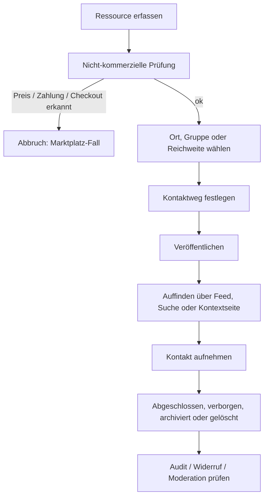

# RESSOURCEN_FLOW.md - Ressourcen-Flow für LOCUTERRA V0.1

Stand: 2026-05-16

> Dieses Dokument beschreibt den operativen MVP-Flow für nicht-kommerzielle
> Ressourcen in LOCUTERRA: einstellen, sichtbar machen, kontaktieren und
> wieder entfernen.

## Ziel

Der Flow übersetzt die fachliche Trennung aus `RESSOURCEN_UND_MARKTPLATZ.md`
in eine konkrete Benutzerführung. Er ist für den Web/PWA-first-Ansatz gedacht:
Ressourcen werden häufig unterwegs oder direkt vor Ort erfasst, später aber
auch am Desktop verwaltet. Deshalb muss der Ablauf auf Mobilgeräten schnell,
auf größeren Displays aber weiterhin nachvollziehbar bleiben.

## Geltungsbereich

Dieser Flow gilt nur für nicht-kommerzielle Ressourcen im MVP 0.1:

- Angebote, Gesuche, Skills, Werkzeuge, Räume und Hilfeleistungen
- keine Preise, keine Gebühren, kein Checkout, keine Provision
- keine Kaufabwicklung und keine Zahlungslogik

Sobald ein Eintrag monetär wird, gehört er nicht mehr in diesen Flow, sondern
in das spätere Marktplatzmodul.

## Beteiligte

- Kontoinhaber oder Steward, der die Ressource anlegt
- Konten, die die Ressource sehen dürfen
- Konten, die eine Kontaktaufnahme starten dürfen
- Moderation, falls ein Eintrag gemeldet oder gesperrt wird

## Flow-Übersicht

## Schritt 1: Ressource erfassen

Die Erfassung muss mindestens diese Angaben erlauben:

- Typ der Ressource, zum Beispiel Angebot, Gesuch, Hilfe oder Raum
- Titel und kurze Beschreibung
- Bezug zu Ort, Gruppe oder beidem
- gewünschte Reichweite aus dem Reichweitenmodell
- gewünschter Kontaktweg

Die Erfassungsmaske soll bewusst schlank bleiben. Für das MVP reicht ein
einfacher, klarer Dialog statt eines mehrstufigen Formulars.

## Schritt 2: Nicht-kommerzielle Prüfung

Vor dem Veröffentlichen prüft LOCUTERRA den Eintrag auf Hinweise auf Geld oder
Vertragsabwicklung.

Ein Eintrag darf nicht als Ressource veröffentlicht werden, wenn er:

- einen Preis nennt
- Versandkosten oder Gebühren verlangt
- eine verbindliche Bestellung vorsieht
- Provision, Bezahlung oder Checkout braucht

Dann muss der Eintrag in den Marktplatz-Fall umgeleitet oder abgelehnt werden.

## Schritt 3: Ort, Gruppe oder Reichweite wählen

Die Ressource braucht einen fachlichen Anker:

- einen Ort, an dem sie gilt
- eine Gruppe, der sie zugeordnet ist
- oder eine Reichweite, die ihre Auffindbarkeit beschreibt

Die Reichweite steuert die Auffindbarkeit, nicht automatisch den Zugriff auf
Kontaktwege oder Klardaten. Das bleibt mit `visibility_policy` und `consent`
getrennt.

## Schritt 4: Kontaktweg festlegen

Für den MVP sind zwei Kontaktwege besonders wichtig:

1. Direktnachricht an den Anbieter
2. Strukturierte Anfrage über einen Ressourcen-Thread

Wenn für die Kontaktaufnahme zusätzliche personenbezogene Daten oder echte
Kontaktwege sichtbar werden sollen, braucht es eine ausdrückliche Einwilligung.

Wenn der Anbieter nur über einen internen Thread erreichbar sein soll, bleibt
der Kontakt innerhalb von LOCUTERRA und gibt keine äußeren Kontaktdaten frei.

## Schritt 5: Veröffentlichen

Beim Veröffentlichen werden die fachlichen Objekte angelegt oder aktualisiert:

- `resource`
- `visibility_policy`
- optional `consent`
- optional `audit_event`

Der Eintrag erscheint danach in den passenden Feeds, Ortsansichten oder
Gruppenansichten und ist über Suche oder Kontextlisten auffindbar.

## Schritt 6: Auffinden und Kontaktieren

Nutzer sollen Ressourcen über drei Wege entdecken können:

- direkt im Orts- oder Gruppen-Kontext
- über eine Suche innerhalb der sichtbaren Reichweite
- über verknüpfte Profile oder Kanäle, sofern erlaubt

Die Kontaktaufnahme startet aus dem Ressourcen-Detail. Dort muss klar sein:

- wer der Ansprechpartner ist
- welcher Kontext den Kontakt erlaubt
- ob die Antwort im internen Thread bleibt oder eine Freigabe braucht

## Schritt 7: Abschließen, verbergen oder archivieren

Der Eigentümer oder Steward kann eine Ressource wieder aus dem aktiven Betrieb
nehmen:

- `hidden`, wenn sie vorübergehend nicht sichtbar sein soll
- `archived`, wenn sie erledigt oder ausgelaufen ist
- `deleted`, wenn sie entfernt werden muss

Das Verbergen oder Archivieren entfernt die Ressource aus der normalen
Entdeckung, ohne die fachliche Historie unnötig zu zerstören.

## Schritt 8: Moderation und Missbrauch

Wenn ein Ressourceneintrag problematisch wirkt, gilt der Sicherheits- und
Missbrauchsrahmen aus `SICHERHEIT_UND_MISSBRAUCH.md`.

Typische Fälle:

- Fake-Angebote
- Spam über Kontaktanfragen
- Ortsdatenmissbrauch
- schleichende Kommerzialisierung

Moderation soll zuerst verbergen oder begrenzen, nicht vorschnell löschen.
Löschung bleibt der letzte Schritt, wenn Nachvollziehbarkeit und Schutz das
zulassen.

## Abgrenzung zum Marktplatz

Sobald ein Eintrag verkauft, vermietet, vermittelt gegen Gebühr oder bezahlt
abgewickelt werden soll, endet dieser Flow.

Dann gilt:

- kein Ressourcen-Eintrag mit versteckten Geldfeldern
- keine Umdeutung einer Ressource in einen Marktplatzartikel
- kein gemeinsamer UI-Flow für beide Domänen

Die strukturelle Trennung bleibt in `RESSOURCEN_UND_MARKTPLATZ.md` verankert.

## Bezug zum Datenmodell

Dieser Flow nutzt die bereits modellierten Fachobjekte:

- `resource` für den Inhalt
- `visibility_policy` für die Sichtbarkeit
- `consent` für Kontaktfreigaben
- `conversation` und `message` für die Kontaktaufnahme
- `audit_event` für sensible Änderungen

## Nächste technische Ableitung

Wenn LOCUTERRA in Code übergeht, sollte dieser Flow zuerst als end-to-end
prüfbarer Pfad umgesetzt werden:

1. Ressource anlegen
2. Sichtbarkeit speichern
3. Kontakt auslösen
4. Ressource archivieren oder löschen

Für den Web/PWA-first-Stack eignet sich dafür ein schlanker Flow-Test mit
`Playwright` und eine Validierungslogik mit `Zod`.

